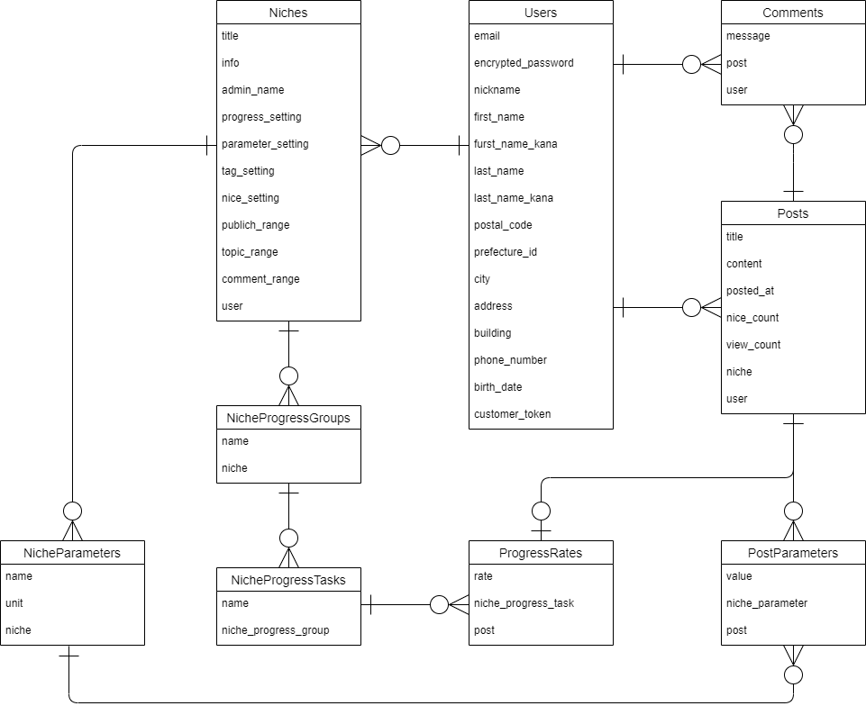

# アプリ名
**ニッチメーカー**
# 企画
## ペルソナ
### 年齢と性別
- 趣味や生活など、ニッチな情報を共有したいと考えているので、「性別は男女問わず」に設定します。
- ある程度余裕のある年齢層で、かつSNSが生活の一部であると思われる「20~30代」とします。
### 職業
- ニッチな情報を共有したいと考える人が対象なため、職業は設定しないようにします。
### 趣味
- 多種多様なジャンルが共存かつ住み分け可能なため、特定の趣味に限定しないようにします。
- コンセプトが「ニッチ」なため、趣味以外にも、個人的な生活の一部も対象にしたいと考えています。

## ユーザーストーリー
　世の中には、たくさんのニッチが溢れています。  
　趣味や個人的な活動を共有するだけでなく、それを自分の記録として残すアプリは、ユーザーにとって非常に価値のあるツールになるでしょう。しかし必ずしも、自分が欲しい機能が備わっているアプリが存在しているとは限りません。  
　例えば、「アニメのコスプレ衣装制作」というニッチを満たすアプリに、どんな機能が望まれるでしょうか？  
1. アクティビティの投稿と記録
2. 記録のグラフ化
3. カレンダーとタイムライン
4. タグとカテゴリ
5. プライベートモード
6. 進捗トラッキング
7. コメントとフィードバック
8. ユーザー間のフォローと繋がり
9. 見た目のカスタマイズ

　これらから、自分の欲しい機能だけを盛り込んだアプリを作ることができる、それが「ニッチメーカー」です。
# 要件定義
## NichesController
### index　（ニッチメーカートップページ）
- 公開範囲
  - 一般
- 遷移
  - 【ヘッダー】ユーザーログアウト時はユーザーサインイン・ユーザーログインページへ遷移できるボタンがある
  - 【ヘッダー】ユーザーログイン時はログアウトできるボタンがある
  - 【ヘッダー】ユーザーログイン時はユーザーマイページへ遷移できるボタンがある
  - 【ヘッダー】ニッチメーカートップページへ遷移するリンクがある
  - ニッチの新規作成へ遷移するボタンがある
  - 各ニッチトップページへ遷移することができる
  - 【フッター】ニッチメーカートップページへ遷移するリンクがある
- 表示
   - 新着ニッチを見ることができる
   - ニッチを検索し、検索結果を一覧表示することができる
   - 並べ替えて表示することができる
  - 【フッター】コピーライトがある
### show　（ニッチトップページ）
- 公開範囲
   - ニッチの作成者または一般（ニッチの設定による）
- 遷移
  - 【ヘッダー】ユーザーログアウト時はユーザーサインイン・ユーザーログインページへ遷移できるボタンがある
  - 【ヘッダー】ユーザーログイン時はログアウトできるボタンがある
  - 【ヘッダー】ユーザーログイン時はユーザーマイページへ遷移できるボタンがある
  - 【ヘッダー】ニッチトップページへ遷移するリンクがある
  - サマリーをクリックで、各トピックに遷移することができる
  - トピックの新規作成へ遷移するボタンがある
  - ニッチ設定ページへ遷移するボタンがある（作成者のみ）
  - 検索するボタンがある
  - 【タブ】サマリーのタイムライン表示へ遷移できるタブがある（デフォルトで選択）
  - 【タブ】グラフ画面へ遷移できるタブがある
  - 【タブ】進捗トラッキングへ遷移できるタブがある
  - 【フッター】ニッチメーカートップページへ遷移するリンクがある
- 表示
  - 検索フォーム（折りたためる）
    - 期間
    - 投稿者
    - 進捗グループ
    - 進捗タスク
    - パラメータキー
    - タグ
  - 【タブ】タイムライン
    - サマリーをタイムラインで一覧表示する（デフォルトタブ）
  - 【タブ】グラフ
    - タイムラインで表示されている範囲のパラメータからグラフを描画
  - 【タブ】ガントチャート表示
    - タイムラインで表示されている範囲の進捗情報からガントチャートを描画
  - 【フッター】コピーライトがある
### edit　（ニッチ設定ページ）
- 公開範囲
   - ニッチの作成者
- 遷移
  - 【ヘッダー】ユーザーログアウトできるボタンがある
  - 【ヘッダー】ニッチトップページへ遷移するリンクがある
  - 【ヘッダー】ユーザーログイン時はユーザーマイページへ遷移できるボタンがある
  - ニッチへ反映ボタンがある
  - ニッチを削除ボタンがある
  - 戻るボタンがある
  - 【フッター】ニッチメーカートップページへ遷移するリンクがある
- 表示
  - ニッチ編集フォーム
    - 管理者名の編集
    - ニッチのタイトル編集
    - 進捗記録項目の有無設定
    - 進捗情報の設定（複数）
      - グループ
      - タスク
    - パラメータ項目の有無設定
    - パラメーターの設定（複数）
      - 項目名
      - 単位
    - タグの有無設定
    - いいね有無設定
    - 公開範囲設定
    - トピック投稿可能範囲設定
    - コメント可能範囲設定
  - 【フッター】コピーライトがある
### new　（ニッチ新規作成ページ）
- 公開範囲
   - ユーザーログイン者
- 遷移
  - 【ヘッダー】ユーザーログアウトできるボタンがある
  - 【ヘッダー】ニッチメーカートップページへ遷移するリンクがある
  - 【ヘッダー】ユーザーログイン時はユーザーマイページへ遷移できるボタンがある
  - ニッチを作成するボタンがある
  - 戻るボタンがある
  - 【フッター】ニッチメーカートップページへ遷移するリンクがある
- 表示
  - ニッチ新規作成フォーム
    - 管理者名の入力
    - ニッチのタイトル入力
    - 進捗記録項目の有無設定
    - 進捗情報の設定（複数）
      - グループ
      - タスク
    - パラメータ項目の有無設定
    - パラメーターの設定（複数）
      - 項目名
      - 単位
    - タグの有無設定
    - いいね有無設定
    - 公開範囲設定
    - トピック投稿可能範囲設定
    - コメント可能範囲設定
  - 【フッター】コピーライトがある
## RegistrationsController
### show　（ユーザーマイページ）
- 公開範囲
   - ユーザー作成者
- 遷移
  - 【ヘッダー】ニッチトップページまたはニッチメーカートップページへ遷移するリンクがある（遷移元によって異なる）
  - 【ヘッダー】ユーザーログアウトできるボタンがある
  - 一覧のリンクから各ニッチトップページへ遷移することができる
  - ユーザー編集ページへ遷移することができる
  - 戻るボタンがある（遷移元によって異なる）
  - 【フッター】ニッチメーカートップページへ遷移するリンクがある
- 表示
   - 自分が作成したニッチの一覧
   - 登録情報表示
      - ニックネーム
      - 名前
      - 住所
      - 電話番号
      - メールアドレス
      - パスワード
      - クレジット情報
   - 【フッター】コピーライトがある
### edit　（ユーザー編集ページ）
- 公開範囲
  - ユーザー作成者
- 遷移
  - 【ヘッダー】ニッチトップページまたはニッチメーカートップページへ遷移するリンクがある（遷移元によって異なる）
  - ユーザーログアウトできるボタンがある
  - 戻るボタンで、ユーザーマイページへ遷移できる
  - 【フッター】ニッチメーカートップページへ遷移するリンクがある
- 表示
   - 登録情報編集フォーム
      - ニックネーム
      - 名前
      - 住所
      - 電話番号
      - メールアドレス
      - パスワード
      - クレジット情報
   - 【フッター】コピーライトがある
### new　（ユーザーサインインページ）
- 公開範囲
  - 一般
- 遷移
  - 【ヘッダー】ニッチメーカートップページへ遷移するリンクがある
  - 登録するボタンがある
  - 戻るボタンで、遷移元へ遷移できる
  - 【フッター】ニッチメーカートップページへ遷移するリンクがある
- 表示
   - 新規登録フォーム
      - ニックネーム
      - 名前
      - 住所
      - 電話番号
      - メールアドレス
      - パスワード
      - クレジット情報
   - 【フッター】コピーライトがある
## SessionsController
### new　（ユーザーログインページ）
- 公開範囲
  - 一般
- 遷移
  - 【ヘッダー】ニッチトップページまたはニッチメーカートップページへ遷移するリンクがある（遷移元によって異なる）
  - ログインするボタンがある
  - 戻るボタンで、遷移元へ遷移できる
  - 【フッター】ニッチメーカートップページへ遷移するリンクがある
- 表示
  - ログインフォーム
    - メールアドレス
    - パスワード
  - 【フッター】コピーライトがある
## PostsController
### show　（投稿詳細ページ）
- 公開範囲
  - ニッチの作成者または一般（ニッチの設定による）
- 遷移
  - 【ヘッダー】ユーザーログアウト時はユーザーサインイン・ユーザーログインページへ遷移できるボタンがある
  - 【ヘッダー】ユーザーログイン時はログアウトできるボタンがある
  - 【ヘッダー】ユーザーログイン時はユーザーマイページへ遷移できるボタンがある
  - 【ヘッダー】ニッチトップページへ遷移するリンクがある
  - コメントするボタンがある
  - いいねボタンがある
  - 【フッター】ニッチメーカートップページへ遷移するリンクがある
- 表示
  - 投稿の詳細
    - 投稿者
    - 投稿日時
    - タイトル
    - 画像
    - 進捗情報
      - グループ
      - タスク
      - 進捗率
    - パラメーター（複数）
      - 項目名
      - 値
      - 単位
    - 説明文
  - いいね数
  - コメント一覧
  - コメント入力フォーム
    - コメント
    - 名前
  - 【フッター】コピーライトがある
### edit　（投稿編集ページ）
- 公開範囲
  - 投稿者
- 遷移
  - 【ヘッダー】ユーザーログイン時はログアウトできるボタンがある
  - 【ヘッダー】ユーザーログイン時はユーザーマイページへ遷移できるボタンがある
  - 【ヘッダー】ニッチトップページへ遷移するリンクがある
  - 編集するボタンがある
  - 【フッター】ニッチメーカートップページへ遷移するリンクがある
- 表示
  - 投稿編集フォーム
    - 投稿者
    - 投稿日時
    - タイトル
    - 画像
    - 進捗情報
      - グループ
      - タスク
      - 進捗率
    - パラメータ（複数）
      - 項目名（プルダウン）
      - 値（入力）
      - 単位（ラベル）
    - 説明文
  - 【フッター】コピーライトがある
### new　（新規投稿ページ）
- 公開範囲
  - ニッチの作成者または一般（ニッチの設定による）
- 遷移
  - 【ヘッダー】ユーザーログイン時はログアウトできるボタンがある
  - 【ヘッダー】ユーザーログイン時はユーザーマイページへ遷移できるボタンがある
  - 【ヘッダー】ニッチトップページへ遷移するリンクがある
  - 新規投稿するボタンがある
  - 【フッター】ニッチメーカートップページへ遷移するリンクがある
- 表示
  - 新規投稿フォーム
    - 投稿者
    - 投稿日時
    - タイトル
    - 画像
    - 進捗情報
      - グループ（プルダウン）
      - タスク（プルダウン）
      - 進捗率
    - パラメータ（複数）
      - 項目名（プルダウン）
      - 値（入力）
      - 単位（ラベル）
    - 説明文
  - 【フッター】コピーライトがある
## 画面無しコントローラークラス
### CommentsController
- コメントの処理
### NicheProgressGroupsController
- ニッチ固有の進捗グループの設定（グループ名）
### NicheProgressTasksController
- ニッチ固有の進捗タスクの設定（タスク名、期間）
### NicheParametersController
- ニッチ固有のパラメーターの設定（パラメーター名、単位）
### PostParametersController
- 投稿記事に関連付けられたニッチ固有のパラメーターとその値
## サービスクラス
### NicheScreensService
- グラフ描画のためのデータ作成
- ガントチャート描画のためのデータ作成
# 基本設計
## DB設計
### Niches
- #### Table
  | Column | Type | Options |
  | --- | --- | --- |
  | title | string | null: false |
  | info | text | null: false |
  | admin_name | string | null: false |
  | progress_setting | string | null: false |
  | parameter_setting | string | null: false |
  | tag_setting | string | null: false |
  | nice_setting | string | null: false |
  | publish_range | string | null: false |
  | topic_range | string | null: false |
  | comment_range | string | null: false |
  | user | references | null: false, foreign_key: true |
- #### Association
  has_many :niche_progress_groups, dependent: :destroy  
  has_many :niche_progress_tasks, dependent: :destroy  
  has_many :niche_parameters, dependent: :destroy  
  has_many :posts, dependent: :destroy  
  belongs_to :user
### Users
- #### Table
  | Column | Type | Options |
  | --- | --- | --- |
  | email | string | null: false, unique: true |
  | encrypted_password | string | null: false |
  | nickname | string | null: false |
  | first_name | string |  |
  | first_name_kana | string |  |
  | last_name | string |  |
  | last_name_kana | string |  |
  | postal_code | 	string |  |
  | prefecture_id | integer | null: false, default: 0 |
  | city | string |  |
  | address | string |  |
  | building | string |  |
  | phone_number | string |  |
  | birth_date | date |  |
  | customer_token | string |  |
- #### Association
  extend ActiveHash::Associations::ActiveRecordExtensions  
  belongs_to :prefecture  
  has_many :niches, dependent: :destroy  
  has_many :posts, dependent: :destroy  
  has_many :comments, dependent: :destroy  
### Posts
- #### Table
  | Column | Type | Options |
  | --- | --- | --- |
  | title | string | null: false |
  | content | text | null: false |
  | posted_at | date | null: false |
  | nice_count | integer | null: false, default: 0 |
  | view_count | integer | null: false, default: 0 |
  | niche | references | null: false, foreign_key: true |
  | user | references | null: false, foreign_key: true |

  ※imageはActiveStorageで実装するため含まない
- #### Association
  has_many :post_parameters, dependent: :destroy  
  has_one :progress_rate, dependent: :destroy  
  has_many :comments, dependent: :destroy  
  belongs_to :user  
  belongs_to :niche  
### Comments
- #### Table
  | Column | Type | Options |
  | --- | --- | --- |
  | message | text | null: false |
  | post | references | null: false, foreign_key: true |
  | user | references | null: false, foreign_key: true |
- #### Association
  belongs_to :user  
  belongs_to :post  
### NicheProgressGroups
- #### Table
  | Column | Type | Options |
  | --- | --- | --- |
  | name | string | null: false |
  | niche | references | null: false, foreign_key: true |
- #### Association
  has_many :niche_progress_tasks, dependent: :destroy  
  belongs_to :niche
### NicheProgressTasks
- #### Table
  | Column | Type | Options |
  | --- | --- | --- |
  | name | string | null: false |
  | niche_progress_group | references | null: false, foreign_key: true |
- #### Association
  has_many :progress_rates, dependent: :destroy  
  belongs_to :niche_progress_group
### ProgressRates
- #### Table
  | Column | Type | Options |
  | --- | --- | --- |
  | rate | decimal | null: false, precision: 5, scale: 2 |
  | niche_progress_task | references | null: false, foreign_key: true |
  | post | references | null: false, foreign_key: true |
- #### Association
  belongs_to :niche_progress_task  
  belongs_to :post
### NicheParameters
- #### Table
  | Column | Type | Options |
  | --- | --- | --- |
  | name | string | null: false |
  | unit | string |  |
  | niche | references | null: false, foreign_key: true |
- #### Association
  has_many :post_parameters, dependent: :destroy  
  belongs_to :niche
### PostParameters
- #### Table
  | Column | Type | Options |
  | --- | --- | --- |
  | value | decimal | null: false, precision: 10, scale: 2 |
  | niche_parameter | references | null: false, foreign_key: true |
  | post | references | null: false, foreign_key: true |
- #### Association
  belongs_to :post  
  belongs_to :niche_parameter
## ER図

## 遷移図
